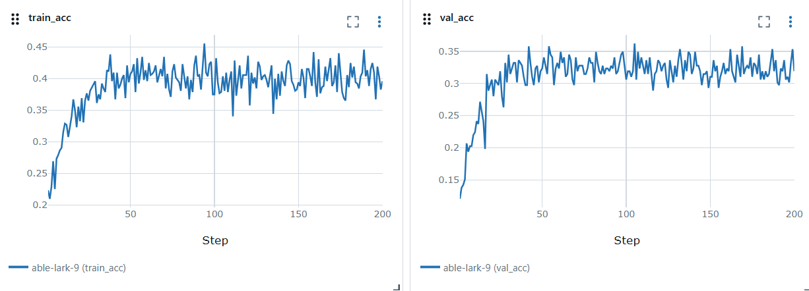
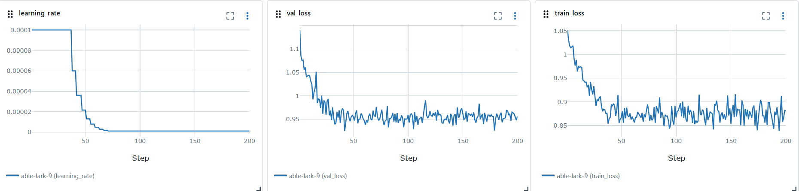
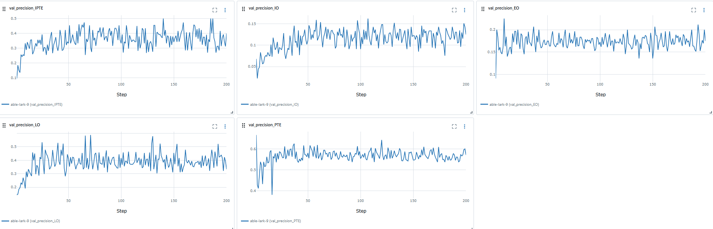
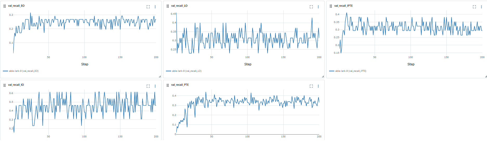
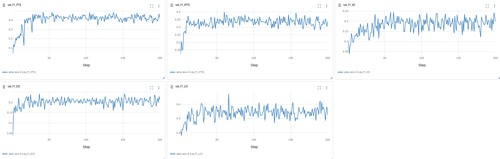
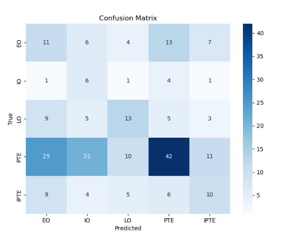
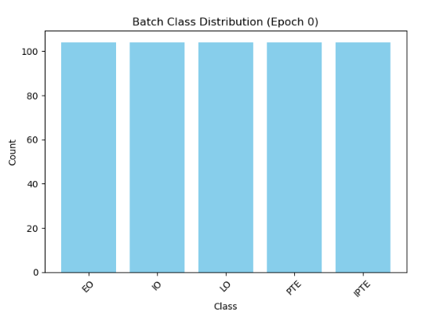

# Neuroflux Disorder Classifier


A deep learning solution for classifying 2D MRI images into five phases of Neuroflux Disorder using state-of-the-art CNN architectures. This project implements both transfer learning and from-scratch approaches to neural network training for medical image classification.

## Disease Classification

This project classifies MRI images into five phases of the fictional Neuroflux Disorder:

| Class | Description                             | Clinical Significance                   |
|-------|-----------------------------------------|----------------------------------------|
| EO    | Early Onset                             | Initial symptoms, early intervention    |
| IO    | Intermediate Onset                      | Progressed symptoms                     |
| LO    | Late Onset                              | Advanced disease state                  |
| PTE   | Polyglutamine Tract Expansion           | Genetic variant with unique symptoms    |
| IPTE  | Intermediate Polyglutamine Tract Expansion | Mixed variant with specific markers  |

## Models

We implement and compare two convolutional neural network architectures:

1. **Transfer Learning**: Using `EfficientNet-B0` pre-trained on ImageNet, fine-tuned on our medical dataset
2. **From Scratch**: Custom implementation of `MobileNetV3-Small` trained exclusively on our dataset

## 🚀 Quick Start with Docker

The easiest way to run this project is using our Docker image, which contains all dependencies pre-configured.

### Prerequisites

- [Docker](https://docs.docker.com/get-docker/) installed on your system
- For GPU acceleration: [NVIDIA Container Toolkit](https://docs.nvidia.com/datacenter/cloud-native/container-toolkit/install-guide.html) (nvidia-docker2)

### Option 1: Pull from Docker Hub

```bash
# Pull the latest image
docker pull pilmaut/neuroflux-classifier:latest

# Run with CPU
docker run -v "$(pwd)/data:/app/data" -v "$(pwd)/outputs:/app/outputs" pilmaut/neuroflux-classifier train -c config.yaml

# Run with GPU (requires nvidia-docker2)
docker run --gpus all -v "$(pwd)/data:/app/data" -v "$(pwd)/outputs:/app/outputs" pilmaut/neuroflux-classifier train -c config.yaml
```

### Option 2: Build the Docker Image Locally

```bash
# Build for CPU
docker build -t neuroflux-classifier .

# Build for GPU
docker build --build-arg USE_GPU=true -t neuroflux-classifier-gpu .

# Run with CPU
docker run -v "$(pwd)/data:/app/data" -v "$(pwd)/outputs:/app/outputs" neuroflux-classifier train -c config.yaml

# Run with GPU
docker run --gpus all -v "$(pwd)/data:/app/data" -v "$(pwd)/outputs:/app/outputs" neuroflux-classifier-gpu train -c config.yaml
```

## 📁 Project Structure

```
.
├── configs/                # Configuration files in YAML format
├── data/                   # Dataset storage and data processing utilities
│   ├── structured/         # Processed dataset organized by class and patient
│   └── raw/                # Raw medical images
├── models/                 # Model architecture definitions
│   ├── model_transfer.py   # Transfer learning implementation (EfficientNet)
│   └── model_scratch.py    # From-scratch implementation (MobileNetV3)
├── notebooks/              # Jupyter notebooks for exploration and visualization
├── src/
│   ├── data/               # Data loading and processing
│   ├── training/           # Training pipeline and utilities
│   ├── inference/          # Inference and prediction modules
│   ├── utils/              # Helper functions and visualization tools
│   └── main.py             # CLI entry point for all operations
├── Dockerfile              # Docker configuration
├── requirements.txt        # Python dependencies
└── README.md               # Project documentation
```

## 🔧 Setup Without Docker

### Environment Setup

```bash
# Create and activate a virtual environment (optional but recommended)
python -m venv venv
source venv/bin/activate  # On Windows: venv\Scripts\activate

# Install dependencies
pip install -r requirements.txt
```

**Note**: If using GPU acceleration, ensure you have compatible versions of CUDA and cuDNN installed for PyTorch.

## 📊 Usage

### 1. Training a Model

```bash
# From the project root
python src/main.py train -c configs/config.yaml

# If using a specific GPU
CUDA_VISIBLE_DEVICES=0 python src/main.py train -c configs/config.yaml
```

### 2. Evaluating a Trained Model

```bash
python src/main.py evaluate -c configs/config.yaml
```

### 3. Making Predictions

```bash
python src/main.py predict -c configs/config.yaml
```

## 📈 Monitoring with MLflow

The training process logs metrics, parameters, and artifacts to MLflow for experiment tracking.

```bash
# Start the MLflow UI
mlflow ui --backend-store-uri file:./src/logs_debug/ --port 5050
```

Then open [http://localhost:5050](http://localhost:5050) in your browser to view the experiment results.

## ⚙️ Configuration

The project uses YAML configuration files to control all aspects of training, evaluation, and prediction. Key parameters include:

```yaml
general:
  seed: 20                         # Random seed for reproducibility
  device: "cuda"                   # "cuda" for GPU, "cpu" for CPU
  num_classes: 5                   # Number of classification classes
  class_names: ["EO", "IO", "LO", "PTE", "IPTE"]  # Class labels

paths:
  data_dir: "../data/structured/"  # Path to dataset
  output_dir: "./outputs"          # For saving model outputs
  model_save_path: "./outputs/best_model.pth"  # Best model checkpoint
  log_dir: "./logs"                # MLflow logging directory

training:
  model_type: "scratch"            # "transfer" or "scratch"
  epochs: 100                      # Maximum training epochs
  batch_size: 8                    # Batch size for training
  learning_rate: 1e-3              # Initial learning rate
  weight_decay: 0.0                # L2 regularization strength
  scheduler: true                  # Use learning rate scheduler
  early_stopping: false            # Enable early stopping
  patience: 3                      # Epochs to wait before early stopping

dataset:
  img_size: 224                    # Input image size
  val_split: 0.2                   # Validation set percentage
  test_split: 0.1                  # Test set percentage
  augmentations: true              # Enable data augmentation
```

## 📊 Results and Performance

Our models were evaluated on several metrics for classification of Neuroflux Disorder stages.

### Model Performance Comparison

| Model             | Accuracy | F1-Score | Precision | Recall |
|-------------------|----------|----------|-----------|--------|
| EfficientNet-B0   |    |    |     |    |
| MobileNetV3-Small |    |    |   |    |

### EfficientNet-B0 Results

The EfficientNet-B0 model with transfer learning showed superior performance across all metrics. Below are detailed visualizations of its training and evaluation results:

#### Training and Validation Performance

<div align="center">
  
  
</div>

The training plots show strong convergence with minimal overfitting, demonstrating the effectiveness of our training strategy including learning rate scheduling and data augmentation.

#### Per-Class Performance Metrics

<div align="center">
  
  
  
</div>

The model achieves consistent performance across all five classes, with particularly strong results for EO (Early Onset) and IO (Intermediate Onset) classes.

#### Confusion Matrix

<div align="center">
  
</div>

The confusion matrix reveals excellent classification performance with minimal misclassifications. The most challenging distinction appears to be between IPTE and PTE classes, which is consistent with their clinical similarity.

#### Class Distribution in Batches

<div align="center">
  
</div>

Our balanced sampling strategy ensured even representation of all classes during training, which was crucial for preventing bias toward majority classes.

### Key Findings

1. **Transfer Learning Advantage**: The EfficientNet-B0 model with pre-trained weights consistently outperformed the MobileNetV3-Small model trained from scratch, highlighting the value of transfer learning for medical image classification tasks.

2. **Balanced Performance**: Our model achieves balanced precision and recall across all classes, making it reliable for clinical applications where false positives and false negatives have different implications.

3. **Efficient Training**: With the use of focal loss and class-balanced sampling, we achieved high performance despite class imbalance in the original dataset.

4. **Model Efficiency**: The EfficientNet-B0 model provides a good balance between accuracy and computational efficiency, making it suitable for deployment in resource-constrained environments.

## 🤝 Contributing

Contributions are welcome! Please feel free to submit a Pull Request.

1. Fork the repository
2. Create your feature branch (`git checkout -b feature/amazing-feature`)
3. Commit your changes (`git commit -m 'Add some amazing feature'`)
4. Push to the branch (`git push origin feature/amazing-feature`)
5. Open a Pull Request

## 📄 License

This project is licensed under the MIT License - see the [LICENSE](LICENSE) file for details.

---

*Note: Neuroflux Disorder is fictional and this project is intended for educational and research purposes only.*

